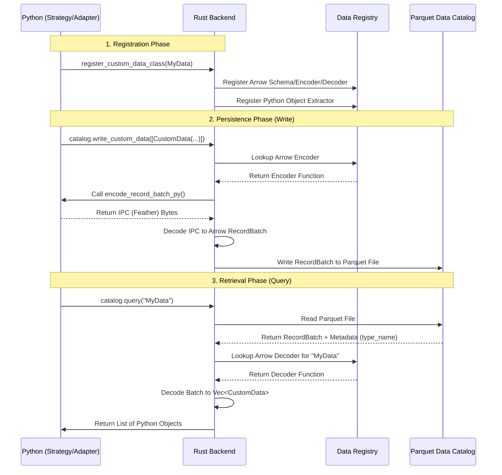
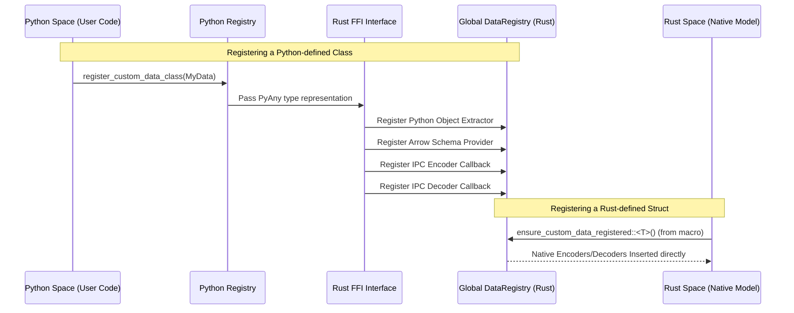
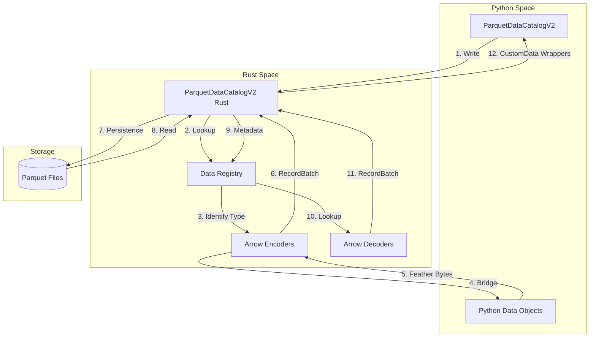

# Custom Data Architecture

Nautilus Trader allows users to define custom data types in both Python and Rust. These types can be used for live streaming, backtesting, and persistence in the data catalog.

---

## High-Level Data Flow

The following diagram illustrates the life cycle of custom data from definition to persistence and back to consumption.

---

## Detailed Registration Process

Registration is the mechanism that bridges the gap between different memory spaces (Python and Rust) and potentially different shared objects (like compiled `rustimport` extensions).

### Python Registration

When you call `register_custom_data_class(MyData)` from Python:

1. **Python Registry**: The class is registered in `nautilus_trader.serialization` for JSON and Arrow.
2. **Rust Python Extractor**: A function is registered in Rust that can take a `PyAny` object and wrap it in a `PythonCustomDataWrapper`. This wrapper implements `CustomDataTrait` by calling back into Python via the GIL.
3. **Rust Arrow Registry**: Schema information and callbacks for encoding/decoding are registered in the global `DataRegistry` in `crates/model/src/data/registry.rs`.

### Rust Registration

For Rust-defined types (using the `#[custom_data]` macro):

1. **Trait Implementation**: The macro generates code to implement `CustomDataTrait`, `ArrowSchemaProvider`, `EncodeToRecordBatch`, and `DecodeDataFromRecordBatch`.
2. **Registry Insertion**: `ensure_custom_data_registered::<T>()` is called (usually at module load) to insert the type's logic into the `DataRegistry`.

---

## The "Feather Bridge" (Serialization Flow)

Since custom data types are often defined in Python, the Rust backend cannot know how to serialize them to Arrow automatically. Nautilus uses an **Arrow IPC (Feather)** bridge to solve this.

### Encoding (Rust -> Parquet)

When writing Python custom data to the catalog:

1. **The Trigger**: The Rust backend's `catalog.write_custom_data()` method iterates over the provided items.
2. **The Wrapper**: If the item is a Python object, it's held by a `PythonCustomDataWrapper`.
3. **The Call-Back**: The wrapper's `encode_record_batch` method is called.
4. **Python Execution**: Rust acquires the GIL and calls `MyData.encode_record_batch_py(list_of_items)`.
5. **PyArrow Serialization**:
    - The Python method converts items to a list of dicts.
    - It creates a `pyarrow.RecordBatch`.
    - It writes this batch to a buffer using `pa.ipc.new_file` (**Feather/IPC File format**).
6. **The Hand-off**: The bytes are returned to Rust.
7. **Rust Deserialization**: Rust uses `arrow::ipc::reader::FileReader` to turn those bytes back into a native Rust `RecordBatch`.
8. **Final Write**: The `RecordBatch` is appended to the Parquet file.

### Decoding (Parquet -> Rust -> Python)

1. **Metadata Lookup**: Parquet files for custom data contain a `type_name` in their metadata or a `data_type` column.
2. **Dynamic Dispatch**: The `CustomDataDecoder` looks up the registered decoder for that `type_name`.
3. **Reconstruction**:
    - If it's a Rust type, the native `decode_batch` is called (zero Python involvement).
    - If it's a Python type, the decoder reconstructs the Python objects using their `from_dict` or `from_json` methods.

---

## Catalog and Writer Architecture

The `ParquetDataCatalogV2` manages the physical storage layout and query planning.

### Explanation of Architecture Flows

#### Writing Data (Arrows 1-7)

1. **Write Execution**: The process starts in Python when `catalog.write_custom_data(items)` is called. The `items` MUST be a list of `CustomData` objects (the Rust-level wrapper). This ensures that each data point is associated with a `DataType` (containing the `type_name`).
2. **Registry Lookup**: The Rust catalog inspects the `type_name` stored inside the `CustomData` wrappers and queries the global `DataRegistry` to find the appropriate serialization logic.
3. **Identify Encoder**: The registry identifies and returns the `ArrowEncoder` (a closure or trait object) registered for that specific type.
4. **The Bridge**: For Python-defined types, the encoder activates the "Feather Bridge." It acquires the GIL and calls the `encode_record_batch_py` method on the Python data objects.
5. **IPC Serialization**: In Python, the objects use `pyarrow` to convert themselves into a `RecordBatch` and then into an IPC (Feather) byte stream. These bytes are returned across the FFI boundary to Rust.
6. **RecordBatch Reconstruction**: The Rust encoder takes the IPC bytes and reconstructs a native `arrow::record_batch::RecordBatch`.
7. **Persistence**: The catalog appends the `RecordBatch` to the Parquet file on disk, ensuring that schema metadata and `type_name` information are correctly preserved.

#### Reading Data (Arrows 8-12)

8. **File Read**: When `catalog.query` is called, the Rust catalog reads the relevant Parquet files from storage (local or cloud).
9. **Metadata Extraction**: The catalog reads the Parquet file metadata to determine the `type_name` of the stored data.
10. **Identify Decoder**: The `DataRegistry` is queried to find the `ArrowDecoder` corresponding to that `type_name`.
11. **Batch Decoding**: The decoder converts the raw `RecordBatch` from the file into a `Vec<CustomData>` of native Rust wrappers.
12. **Python Restoration**: These wrappers are returned to Python. When accessed, they either return the original Rust objects (if defined in Rust) or reconstruct the Python objects using their registered deserialization methods.

### Key Differences from Built-in Data

- **Built-in Data** (e.g., `QuoteTick`): Schemas are hardcoded in Rust. Serialization is highly optimized via direct buffer writes in Rust. No GIL involvement.
- **Custom Data**: Schemas are dynamic. Serialization for Python types involves the "Feather Bridge," making it slightly slower than built-in types but highly flexible.
